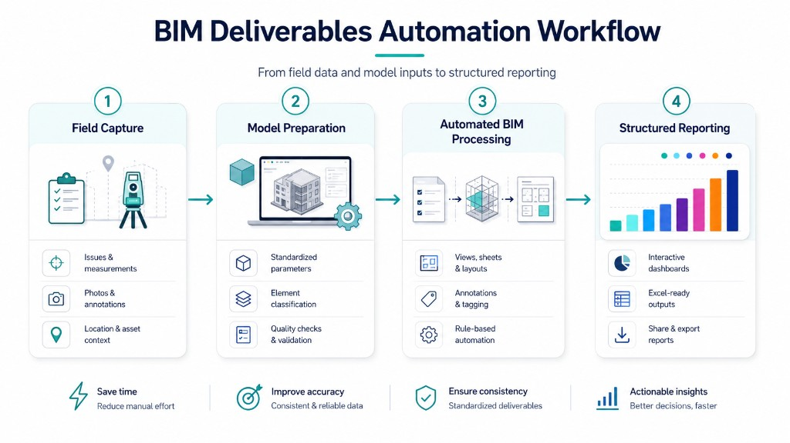

**Client:** INICA

**Industry:** Hospitality

**Service:** BIM Process Automation

**Location:** Punta Cana, Dominican Republic

## Overview

In June 2026, INFRATEK partnered with INICA to modernize how project deliverables are produced on the Moon Palace Punta Cana development. The goal was straightforward: reduce the repetitive manual work that slows teams down, and give the organization a faster, more consistent way to move from field information to finished reports.

Instead of preparing documentation by hand, INICA's teams now rely on a structured, automated workflow that connects site data, project models, and the company's existing reporting formats. The result is less rework, more consistency across deliverables, and information that is ready to share with stakeholders sooner.

## Results

- **30% to 80% reduction in manual effort** across the project's repetitive documentation activities
- Faster turnaround from field capture to reviewed, client-ready reports
- Consistent, standardized deliverables that reduce errors and rework
- A scalable foundation the organization can reuse across active and future contracts

## What We Delivered

- An automated workflow that produces project views, sheets, and reports on demand
- Reports generated directly into INICA's existing templates, complete with plans, sketches, and images
- A clear field-to-office process, supported by documentation and team guidance so the system keeps delivering value over time

## Services Provided

- BIM Process Automation
- Digital Workflow Design and Integration
- Automated Reporting and Deliverable Production

This project reflects INFRATEK's focus on helping large organizations turn slow, repetitive processes into efficient, standardized, and scalable digital workflows.
